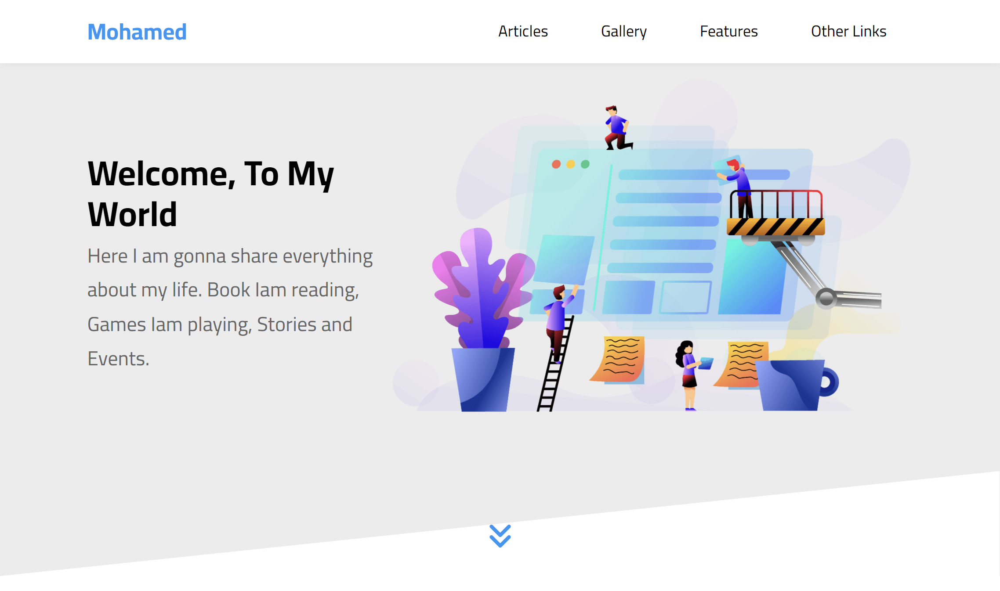
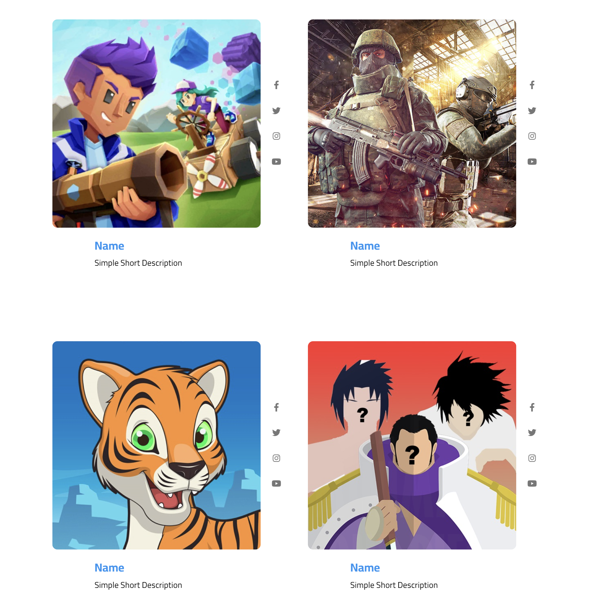
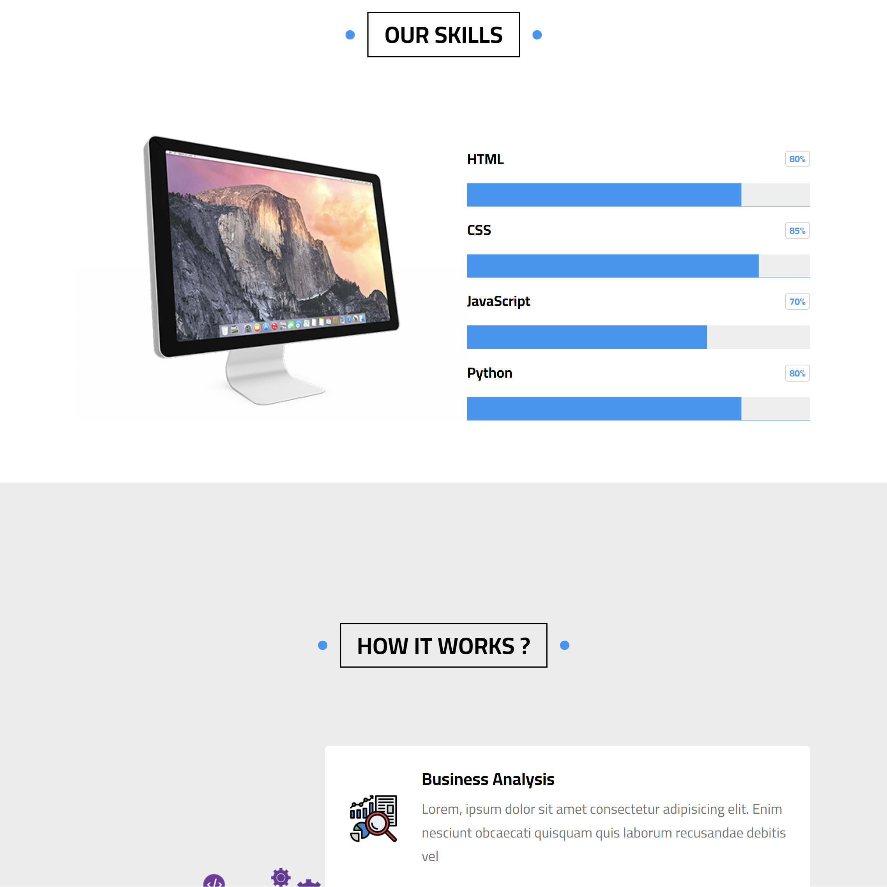

#  HTML - CSS template 3

## Table of contents

- [Overview](#overview)
  - [Screenshot](#screenshot)
  - [Links](#links)
- [My process](#my-process)
  - [Built with](#built-with)
  - [What I learned](#what-i-learned)
  - [Continued development](#continued-development)
- [Author](#author)
- [Acknowledgments](#acknowledgments)

## Overview

### Screenshot

### Links

- Live Site URL: [Live](https://mohamed-template-3.netlify.app)

## My process

### Built with

- Semantic HTML5 markup
- CSS custom properties
- Flexbox
- CSS Grid
- Mobile-first workflow

### What I learned

This project made a difference in my html - css abilities since it's a big project with a lot of sections, that made me search a lot for new stuff to learn.

### Continued development

I will start getting some more information about mastering css and learning SASS since I heard It's much faster and more effecient in time.

## Author

- Website - [Mohamed](https://www.mohamed-dev.netlify.app)

## Acknowledgments

The most usefull tip I've heard is taking the problem and dividing it to smaller problems, this approach makes it easier for you to approach solutions and make things work!

### Outro

Thank you for reading! I hope you found the code usefull.
